# DC Motor Controller Firmware for STM32F107/DRV8701

## Software Features

- Start/dashboard workflow for quick motor start-stop and live runtime status
- Selectable control mode: PWM open-loop or RPM-based PID closed-loop
- On-device tuning for speed, brake strength, and stall timeout
- Configurable protection limits for input current, motor current, MOSFET temperature, and motor temperature
- Advanced setup for RPM range, motor direction, and sensor direction
- PID parameter tuning (Kp, Ki, Kd, anti-windup) with live parameter apply and graph
- Diagnostics screen with firmware/PCB info and live min/max telemetry (VCC, current, temperatures, RPM/PWM)
- EEPROM-backed settings with save/restore-defaults from the menu
- LVGL TFT UI with rotary encoder plus dedicated start/back/knob buttons
- Python Tool for configuration and parameter tuning over SWD or USB serial connection

## [Change Log](docs/CHANGELOG.md)

## Hardware Features

- 8-36V, 20A continuous, 40A peak
- Adjustable cycle by cycle motor current limit (0.5-40A)
- Adjustable current limit with signal LED (0.5-40A)
- 1.14" 135x240 TFT display, rotary encoder and 3 buttons for easy navigation
- Support for magnetic encoder MT6701 in A/B mode up to 1024PPR (55000 RPM)
- Dimmable LED with CC driver 3-32V/350mA/5W
- Current, voltage and temperature monitoring

## Current and voltage protection

### Undervoltage Lockout

The controller has an undervoltage lockout (UVLO) threshold of 5.9V. When the supply voltage drops below this threshold, the motor is disabled briefly to allow the supply voltage to recover.

The red LED indicates an undervoltage condition and turns off after the voltage recovers.

### Overvoltage Protection

Overvoltage protection (OVP) is most likely to be triggered while the motor is braking. Back EMF can cause a substantial increase in the supply voltage, potentially blowing the fuse. Adjust the braking strength and OVP threshold carefully; a limit of 32V is generally safe.

At approximately 38V and above, the OVP is disabled, causing all of the energy to be dissipated through the clamping diode and fuse. When OVP is triggered, braking is disengaged, the red LED turns on, and the display shows a motor OVP error.

### Overcurrent Protection

The controller has two configurable current-protection mechanisms.

#### Motor Current Limit

> The maximum current through the motor winding is regulated by a fixed off-time PWM current regulation, or current chopping. When an H-bridge is enabled in forward or reverse drive, current rises through the winding at a rate dependent on the DC voltage and inductance of the winding. After the current hits the current chopping threshold, the bridge enters a brake (low-side slow decay) mode until tOFF has expired. (TI DRV8701 SLVSCX5B –MARCH 2015–REVISED JULY 2015)

This protection operates silently and does not generate a user-facing error.

#### Input Current Limit

When the maximum input current is reached, the motor current limit is gradually reduced until the condition clears. It is then gradually increased again to prevent immediate retriggering. If the motor current limit is set too low, the input current limit may not function correctly.

The yellow LED indicates that the input current limit has been reached and turns off after recovery.

## Error Codes

The red LED blinks once to indicate an error. The yellow LED then identifies
the error by blinking the corresponding number of times:

| Yellow LED flashes | Description |
|---:|---|
| 1 | A general error was reported |
| 2 | The watchdog interrupt did not respond in time (57ms) |
| 3 | The watchdog timer was not reset in time (1000ms) |
| 4 | The processor encountered a severe, unrecoverable error |
| 5 | The processor accessed memory incorrectly |
| 6 | A critical interrupt occurred that could not be ignored |
| 7 | The processor accessed an invalid or unavailable bus address |
| 8 | The processor detected an invalid instruction or arithmetic operation |

## Navigation

### Rotary Knob Button

- Start screen: open main menu (long press opens advanced menu)
- Dashboard screen: select next value to change (RPM/PWM/PID parameters, etc.), long press selects prev. value

### Start Button

- Start screen: start motor
- Dashboard screen: stop motor

### Back Button

- Start screen: toggle motor direction
- Dashboard screen: stop motor
- Menus: go back to previous menu
- Long press (5 seconds): firmware reset

## Controller schematics and PCB

[Schematics & PCB](https://oshwlab.com/sascha23095123423/project_dzierqaj)

[Schematics PDF](docs/schematic_dc-motor-controller_rev11.pdf)

[Schematics SVG](docs/schematic_dc-motor-controller_rev11.svg)

<a href="docs/schematic_dc-motor-controller_rev11.svg">
	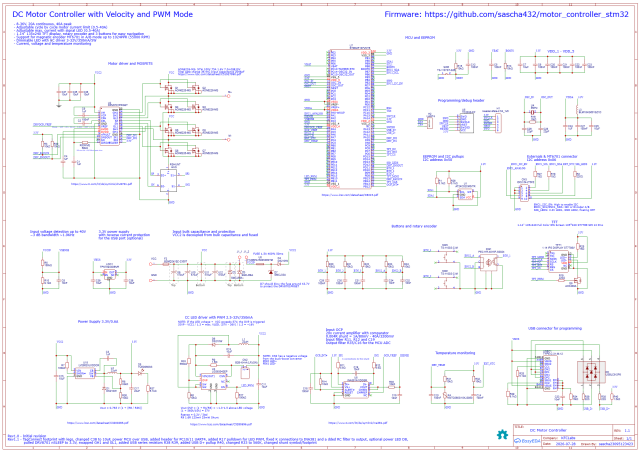
</a>

## STL files for motor mount and enclosure

[STL files](stl/STL.md)

## Some pictures

Demonstration of the DC motor controller running a drill press motor

Screenshots

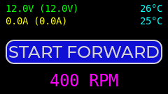
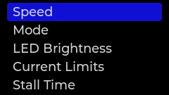
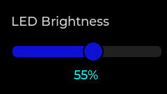

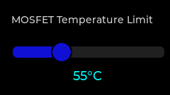
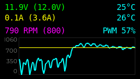
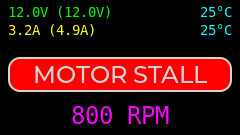

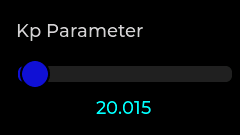
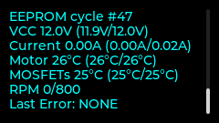

Drill press, controller enclosure and PCB

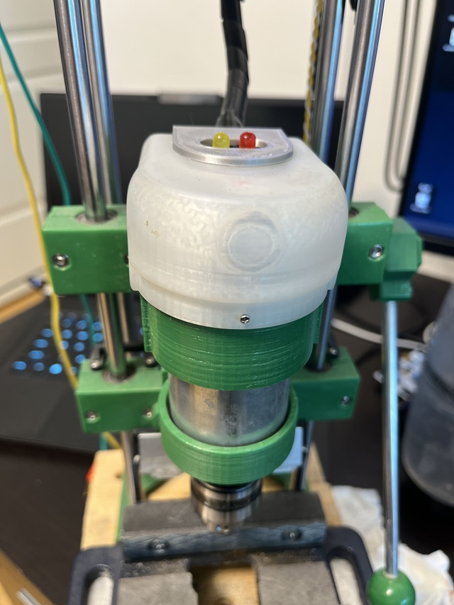

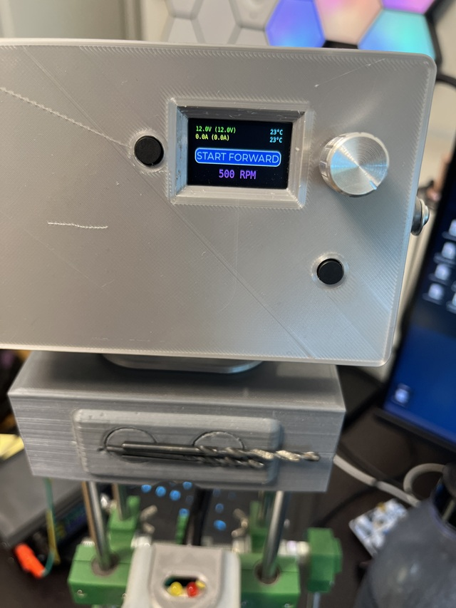

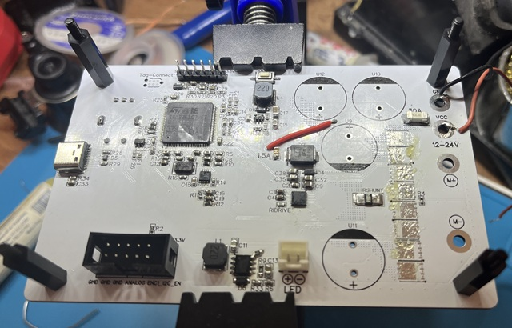

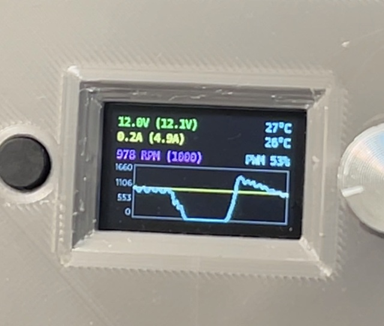

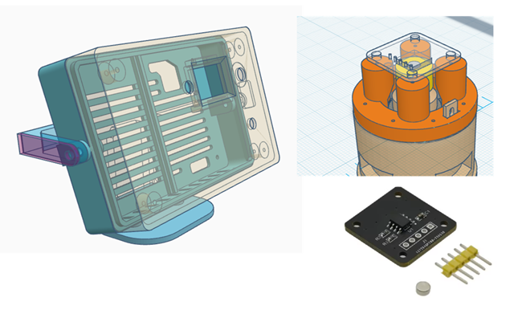

PID tuning software

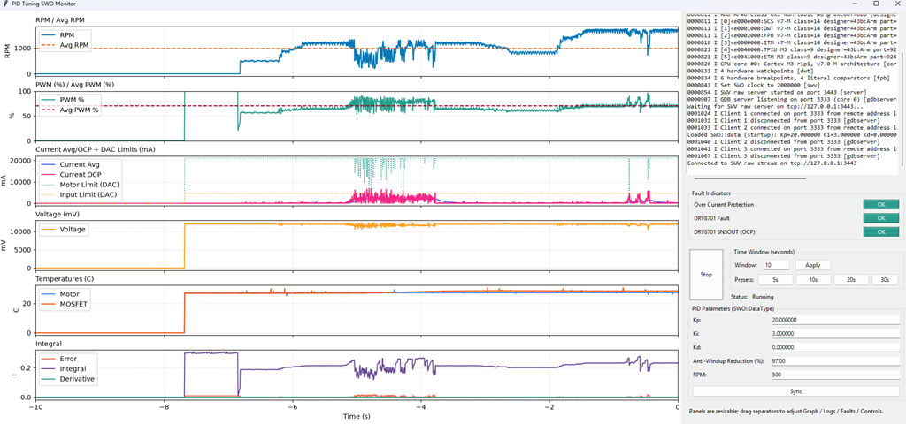
