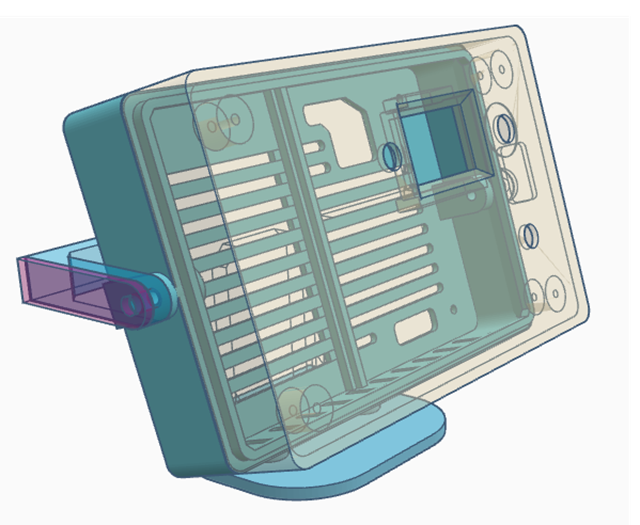
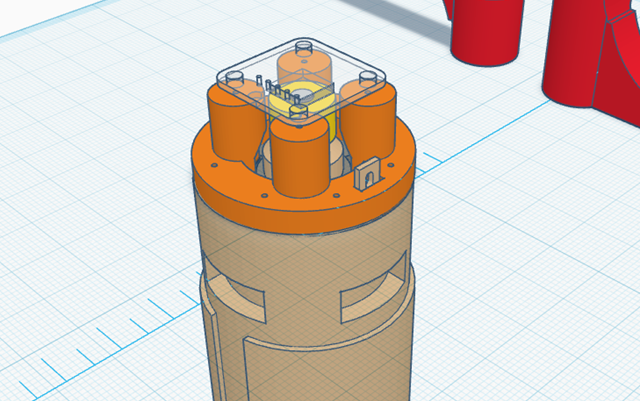
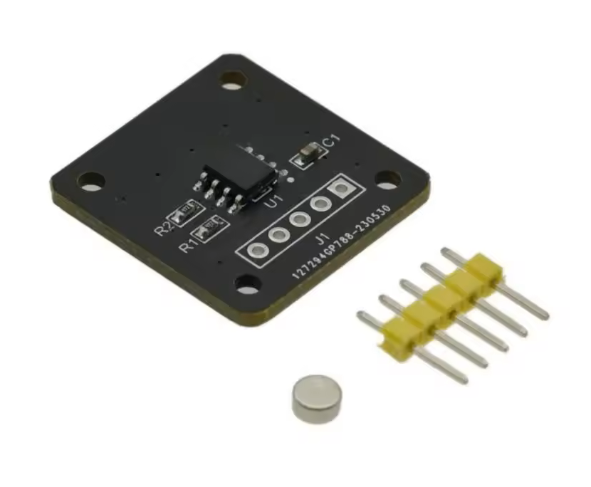
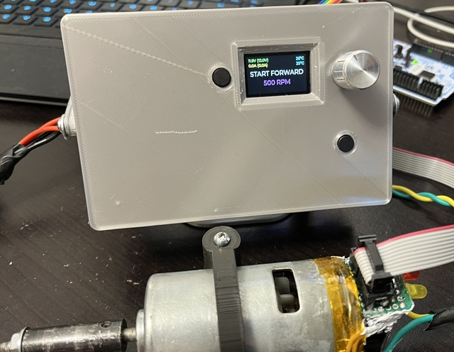
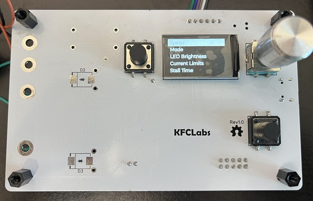

# STL files

This folder contains the .STL files for the MT6701 encoder motor mount and the enclosure for the controller.

## TinkerCad Source files

### 775 Motor Mount For MT6701

https://www.tinkercad.com/things/627dToPH86K-775-motor-mount-for-mt6701-magnetic-encoder

#### Aliexpress MT6701 Module

MT6701 Magnetic Encoder Magnetic Induction Angle Measurement Sensor Module 14bit High Precision Replacement AS5600

The module requires some modifications to enable A/B mode. The controller supports programming over I2C and switching to A/B mode, if the mode selection pin is connected to the controller.

https://www.aliexpress.com/item/1005005796758249.html

### Controller Enclosure

https://www.tinkercad.com/things/fNIPaWNxDLo-motor-controller-enclosure

## Pictures

